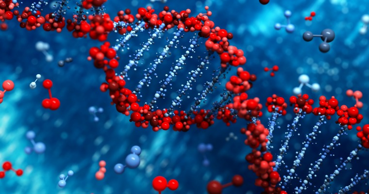

# transcriptase
<p align="center">
   
 </p>


DNA, or deoxyribonucleic acid, is the hereditary material in humans and almost all other organisms. It serves as a 
biological blueprint which is unique to every organism. The information in DNA is stored as a "code" made up of 
four chemical bases: adenine (A), guanine (G), cytosine (C), and thymine (T). 

Human DNA consists of about 3 billion bases, and more than 99 percent of those bases are the same in all people. 
The order, or sequence, of these bases determines the information available for building and maintaining an organism, 
similar to the way in which letters of the alphabet appear in a certain order to form words and sentences.

Since DNA is just the "blueprint," there are other processes that need to occur at the microscopic level to convert
the raw data encoded in DNA, into larger protein structures that serve various functions on the cellular level.

Two main processes occur to turn DNA code into proteins: **transcription** and **translation.**

## Transcription

Transcription is the process of creating an mRNA sequence (precursor to amino acid sequence) from a DNA sequence.

```
A DNA strand                   : TTCGCTGGAGCCGGGCGTTACCTAAACGTTATTTCACGGAAGCTT
It's complementary mRNA strand : AAGCGACCUCGGCCCGCAAUGGAUUUGCAAUAAAGUGCCUUCGAA
```
As we can see above, when we transcribe from DNA to mRNA:

```
T's are "mapped" to A's
A's are "mapped" to U's
C's are "mapped" to G's
G's are "mapped" to C's
```
## Translation

Translation is the process of creating an amino acid sequence (precursor to larger proteins) from an mRNA sequence.

In this step, amino acid chains are created by reading mRNA strands three bases at a time (also called codons). Another cellular component called a ribosome, scans the mRNA strand to look for the signal to start amino acid formation. This start signal is always the codon AUG. Once to start codon is found, the amino acid chain formation begins and grows until the stop codons are found. There are 3 stop codons: UAA, UGA, and UAG.

```
A DNA strand                   : TTCGCTGGAGCCGGGCGTTACCTAAACGTTATTTCACGGAAGCTT
It's complementary mRNA strand : AAGCGACCUCGGCCCGCAAUGGAUUUGCAAUAAAGUGCCUUCGAA                                          
Amino acid sequence            : Met-Asp-Leu-Gln
```
Note, the AUG start codon doesn't appear till halfway through the mRNA strand, so translation doens't occur until then.
When DNA is replicated, minor mutations can happen over long periods of time. Two such types of mutations are **deletion** and
**insertion**. 

Deletion occurs when one or more bases are deleted from a sequence:

```
Strand 1              :TTCGCTGGAGCCGGGCGTTACCTAAACGTTATTT
Deletion on strand 1  :TTCGCTGGAGCGGGCGTTACCTAAACGTTATTT
```

Insertion occurs when one or more bases are added to a sequence:

```
Strand 1              :TTCGCTGGAGCCGGGCGTTACCTAAACGTTATTT
Insertion on strand 1 :TTCGCTGGAGCCGGGCGTTACACTAAACGTTATTT
```
-------------------

This C++ program performs transcription and translation on DNA sequences.

It reads in from the file "frameshift_mutations.txt" where each even line contains a DNA sequence and each odd 
line contains the same DNA sequence with either a deletion or insertion of one base, anywhere in the sequence.

A dictionary file named "codons.tsv" is included to allow for the translation of mRNA to an amino acid sequence. 

The ouput of the program displays the amino-acid sequences for each DNA strand on each line and highlights the effect that even just one insertion or deletion can have on a DNA sequence. Some sequences shorten, some become longer, and others fail to get created altogether.  
